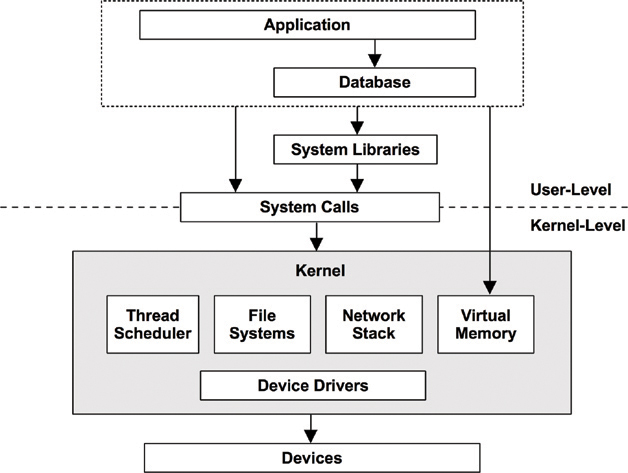

# Performance Engineering

## Introduction
Systems performance is the study of the entire system, including all physical components and the full software stack. Anything in the data path, software or hardware, is included, as it can affect performance. For distributed systems, this means multiple servers and applications.

The term entire stack is sometimes used to describe only the application environment, including databases, applications, and web servers. When speaking of systems performance, however, we use entire stack to mean everything, including system libraries and the kernel.

## Performance Engineer Role

Systems performance as an activity can be done by a variety of roles, including system administrators, support staff, application developers, database administrators, and web administrators. For many of these, performance is a part-time activity, and there may be a tendency to explore performance only within the role’s area of responsibility (the network team checks the network, the database team checks the database, and so on). However, for some performance issues, finding the root cause requires a cooperative effort from these teams.

**We can work with multiple teams and perform a holistic study** of the environment, an approach that may be vital in resolving complex performance issues. We can also identify opportunities to develop better tooling and metrics for system-wide analysis and capacity planning across the environment.

There are also specialty application-specific occupations in the field of performance, for example, for Java performance and Database performance. These often begin with a limited check of system performance before moving to application-specific tools.

## When and how to engage performance engineer
Performance engineering should ideally begin before hardware is chosen or software is written. This can be the first step, involving setting objectives and creating a performance model. Often, products are developed without this step, deferring performance engineering work to later on when a problem arises. With each step of the development process, however, it can become progressively harder to fix performance issues, due to architectural decisions made earlier.

## What needs to be analyzed in an application
We need to choose the performance analysis areas based on application design and architecture. Below are different layers where we can collect metrics to assess the performance and communication
* Client interface layer
* Web Server layer
* App Server layer
* Caching server
* Application layer
* Database layer
* Interface layer
* Transportation layer
* External communication
* Load balancer
* Infrastructure layer of all the above

We need to choose the performance fine tune area based on nature of the application. We will be careful when we analyze vendor application or tools, due to restriction on tuning possibility. Performance analysis approaches need to vary for below type of applications.

* Homegrown application
* Vendor application & tools
* Thick client application
* Web application & Ajax application
* RESTfull application
* Microservices application
* Background load  or scheduled load

All physical components and the full software stack. Anything in the data path, software or hardware.
 - [Performance Metrics for all software and physical stack](/Performance-Metric.md)
 - [Tools for performance analysis](/Performance_Analysis_Tools.md)
 - [System Profiling and Tuning](./system-profiling-and-tuning)
 - Application Program Profiling and Tuning  - TBD
 - [Playbooks](/playbooks)
 
## Performance Engineering Engagement Out Come
* High level recommendation
  * Infra/App level configuration changes to improve the performance
  * Database level recommendation to remove bottle necks
  * Optimization of batch job load, DB backup and UI load
  * Performance monitoring solution to build Appl. health dashboard
* Introduce the Generic Health Dashboard
  * Infrastructure health dashboard
  *	Generic services monitoring dashboard
* Performance improvement area recommendation
  * Application level, Container level, MicroService level
  * Functional Solution level (Performance Perspective)
  * Database level, Integration level
* Infra level
  *	Possible automation recommendation
  *	Recommendation to build possible Application Health Dashboard
  *	Possibility to better utilize the infrastructure footprint or resize the infrastructure

## Summary

Performance analysis allows you to understand and quantify application performance. It provides information on transaction response time that can be used to improve performance, establish SLAs, or establish the need for infrastructure capacity. In short, performance engineering techniques can be used to reduce the guesswork involved in providing application services and allow organizations to meet the needs of their clients.

## FAQ
1)	Can I fine-tune the infrastructure to improve or solve the application performance issue?
Answer: Tune the application performance instead of Increasing/tune the infrastructure for performance issue
  * 80% of the performance improvement can be achieved by tuning application
  * 20% of performance improvement can be achieved by infrastructure level tune

2)	How much time I need to spend to improve the application performance?
Answer: Performance engineering need to be balanced between your performance SLA and actual performance

[Back to top](#performance-engineering)
